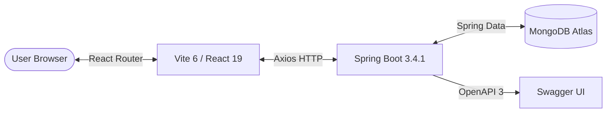

<div align="center">

# 💼 JobSphere

### Modern Full-Stack Job Portal & Recruitment Platform

<p align="center">
  A modern full-stack job portal built with Spring Boot, React, MongoDB, and Tailwind CSS — providing job discovery, search, filtering, job creation, updates, deletion, detailed job views, and a production-ready REST API.
</p>

<!-- Technology Badges -->
<p align="center">
  
  
  
  
  
  
</p>

<p align="center">
  Author: <b>Mohammad Asfin</b> &nbsp;|&nbsp; Stack: <b>Java Full Stack</b> &nbsp;|&nbsp; Database: <b>MongoDB</b> &nbsp;|&nbsp; License: <b>MIT</b> &nbsp;|&nbsp; Version: <b>1.0.0</b>
</p>

<p align="center">
  <a href="#-quick-start">🚀 Quick Start</a> •
  <a href="#-api-docs">📚 API Docs</a> •
  <a href="#-architecture">🏗️ Architecture</a> •
  <a href="#-configuration">⚙️ Configuration</a> •
  <a href="#-deployment">🚀 Deployment</a> •
  <a href="#-contributing">🤝 Contributing</a> •
  <a href="#-report-bug">🐛 Report Bug</a> •
  <a href="#-request-feature">💡 Request Feature</a>
</p>

</div>

---

## 📌 Project Overview

JobSphere is a professional full-stack application connecting top tech talent with innovative employers. It provides a robust, seamless ecosystem where **Employers** can seamlessly post and manage job opportunities, and **Employees** can browse, search, and apply for roles tailored to their exact skill set.

| Layer | Technology | Responsibility |
|---|---|---|
| **Frontend** | React 19 | User interface & core logic |
| **Build Tool** | Vite 6 | Development server & bundling |
| **Styling** | Tailwind CSS v4 | UI components & layout |
| **Routing** | React Router v7 | SPA navigation |
| **HTTP Client** | Axios | API communication |
| **Backend** | Spring Boot 3.4.1 | Core REST API |
| **Database** | MongoDB Atlas | Persistence (`JobListing.JobPost`) |
| **Documentation** | Springdoc OpenAPI | Swagger UI endpoints |

---

## ✨ Key Features

### 👨‍💼 Employer Features
- **Job Management**: Create, update, and completely delete job postings.
- **Structured Forms**: Professional multi-input form validating titles, tech stacks, experience, and salaries.

### 👨‍💻 Employee Features
- **Job Discovery**: Live, responsive feed of available opportunities.
- **Filtering**: Dropdown filters to refine by Job Type and Location.
- **Detailed Views**: Dedicated URLs (`/jobs/:id`) containing rich descriptions and required tech stacks.

### 🔎 Search
The backend utilizes `SearchRepositoryImpl` featuring dynamic `$or` logic to match case-insensitive keywords simultaneously across `title`, `description`, `profile`, `technologies`, `company`, and `location`. No Atlas Search indexing is required.

### 🧪 Demo Mode
Designed to run serverless via LocalStorage. Toggling `VITE_DEMO_MODE=true` instantly switches the React app into a standalone sandbox featuring 20 realistic mock jobs for UI demonstration.

---

## 🏗️ Architecture



---

## 📦 Project Structure

```text
JobSphere/
├── Backend/
│   ├── src/
│   │   ├── main/
│   │   │   ├── java/com/jobsphere/joblisting/
│   │   │   │   ├── controller/   # REST Controllers (PostController)
│   │   │   │   ├── model/        # Document Entities (Post)
│   │   │   │   └── repository/   # MongoDB Repositories
│   │   │   └── resources/
│   │   │       └── application.properties
│   ├── pom.xml
│   └── mvnw.cmd
│
├── Frontend/
│   ├── src/
│   │   ├── components/  # Reusable UI (Navbar, JobForm)
│   │   ├── pages/       # Route Views (Home, Feed, JobDetails)
│   │   ├── services/    # Axios API layer (jobService.js)
│   │   └── data/        # Fallback Mock Data
│   ├── package.json
│   ├── vite.config.js
│   └── .env
│
├── .gitignore
└── README.md
```

---

## ⚙️ Configuration

### Environment Variables

**Backend (`application.properties`)**
The application relies on the system terminal environment for security. 
```bash
# Set this in your PowerShell session before running the backend:
$env:MONGODB_URI="mongodb+srv://<username>:<password>@cluster0.xxx.mongodb.net/?retryWrites=true&w=majority"
```

**Frontend (`Frontend/.env`)**
```env
VITE_API_URL=http://localhost:8080
VITE_DEMO_MODE=false
```

---

## 🚀 Quick Start

### 1. Start the Backend

Open a fresh PowerShell terminal, set your cluster URI, and start Spring Boot:

```powershell
cd "D:\Java Full Stack\JobSphere\Backend"

$env:MONGODB_URI="mongodb+srv://<your-username>:<your-password>@cluster0.abcde.mongodb.net/?retryWrites=true&w=majority"

.\mvnw.cmd clean compile
.\mvnw.cmd spring-boot:run
```
*The API will boot at `http://localhost:8080/`.*

### 2. Start the Frontend

Open a second PowerShell terminal:

```powershell
cd "D:\Java Full Stack\JobSphere\Frontend"
npm install
npm run dev
```
*Vite will start the client at `http://localhost:5173/`.*

---

## 📚 API Docs

When the backend is running, visual documentation is auto-generated at:
👉 **[http://localhost:8080/swagger-ui/index.html](http://localhost:8080/swagger-ui/index.html)**

### Core Endpoints

| Method | Endpoint | Description |
|---|---|---|
| `GET` | `/allPosts` | Retrieve all jobs |
| `GET` | `/posts/{text}` | Search jobs across all fields |
| `POST` | `/post` | Create a new job |
| `PUT` | `/post` | Update an existing job |
| `DELETE` | `/post/{id}` | Delete a job permanently |

---

## 🚀 Deployment

### Vercel Deployment (Frontend)
1. Import the repository into Vercel.
2. Set the Root Directory to `Frontend`.
3. Set Framework Preset to `Vite`.
4. Ensure environment variables are configured in the Vercel dashboard:
   - `VITE_DEMO_MODE=false`
   - `VITE_API_URL=<YOUR_DEPLOYED_BACKEND_URL>`
   *(Note: For SPA routing, Vercel natively handles the `dist` folder generated by `npm run build`.)*

---

## 🐛 Troubleshooting

- **MongoDB "Connection string is invalid"**: The `$env:MONGODB_URI` was not exported in your terminal session before running `./mvnw.cmd`.
- **CORS Errors in Browser**: Ensure `VITE_API_URL` correctly points to the active Spring Boot backend, and that the backend `@CrossOrigin` annotation in `PostController` whitelists your frontend origin.
- **Port 8080 or 5173 Already in Use**: Kill any zombie Java or Node processes occupying the ports.

---

<div align="center">
  <p>Built with 💼 by Mohammad Asfin</p>
</div>
